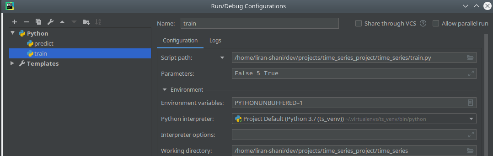
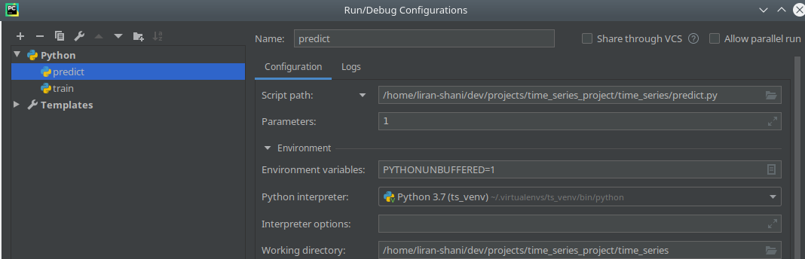

# time_series_project

### Train model

3 params:

1 - with multiprocessing True \ False

2 - how many samples: int, for example: 5

3. use metadata cache: True \ False

Example

### Predict

1 param:

1 - how many samples: int, for example: 1

Example

